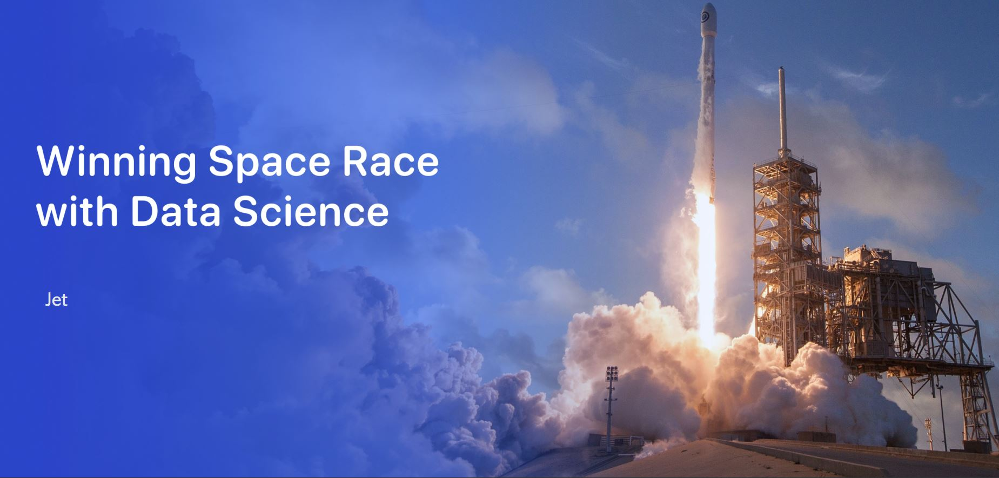

# What is Data Science?

## 📌 Summary
The goal of this capstone project is to predict the successful landing of the Space X Falcon 9 first stage. 

The full report can be found <a href="./ds-capstone-template-coursera .pdf">
here
</a>

### Context and Business Understanding
- SpaceX launches Falcon 9 rockets at a cost of around $62m. This is considerably cheaper than other providers (which usually cost upwards of $165m), and much of the savings are because SpaceX can land, and then re-use the first stage of the rocket.

- If we can make predictions on whether the first stage will land, we can determine the cost of a launch, and use this information to assess whether or not an alternate company should bid against SpaceX for a rocket launch.

## ✏️ Main Topics
This project follows these steps:

1. <a href="./01. Data Collection/">
Data Collection
</a>
  - Making GET requests to the SpaceX REST API
  - Web Scraping
2. <a href="./02. Data Wrangling/">
Data Wrangling
</a>
  - Using the .fillna() method to remove NaN values
  - Using the .value_counts() method to determine the following:
    - Number of launches on each site
    - Number and occurrence of each orbit
    - Number and occurrence of mission outcome per orbit type
  - Creating a landing outcome label that shows the following:
    - 0 when the booster did not land successfully
    - 1 when the booster did land successfully
  3. <a href="./03. Exploratory Data Analysis/">
Exploratory Data Analysis
</a>
  - Using SQL queries to manipulate and evaluate the SpaceX dataset
  - Using Pandas and Matplotlib to visualize relationships between variables, and determine patterns
  4. <a href="./04. Interactive Visual Analytics/">
Interactive Visual Analytics
</a>
  - Geospatial analytics using Folium
  - Creating an interactive dashboard using Plotly Dash
  5.  <a href="./05. Predictive Analysis (Classification)/">
Predictive Analysis (Classification)
</a>
  - Using Scikit-Learn to:
    - Pre-process (standardize) the data
    - Split the data into training and testing data using train_test_split
    - Train different classification models
    - Find hyperparameters using GridSearchCV
  - Plotting confusion matrices for each classification model
  - Assessing the accuracy of each classification model

## 🎯 Key Skills Learned
An overall understanding of what data science is, and why it is changing the way we do business and research.

## 🏅 Certificates
The images contains link to certificates.
    
 

  

