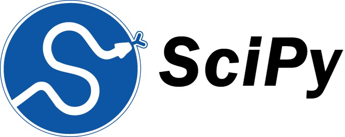

(./Images/ibm.png)

# 💡 About
The [IBM Data Science Professional Certification](https://www.coursera.org/professional-certificates/ibm-data-science) contains of 10 online courses that provide the tools and skills to succeed in data science, including use of open source tools and libraries, Python, databases, SQL, data visualization, data analysis, statistical analysis, predictive modeling, and machine learning algorithms.

This repository contains documentation and resources used to complete the certification, relevant notes and other code snippets, and proof of certification for each course.

# 📖 Courses
- ✅ [01. What is Data Science?](./01.%20What%20is%20Data%20Science/)
- ✅ [02. Tools for Data Science](./02.%20Tools%20for%20Data%20Science/)
- ✅ [03. Data Science Methodology](./03.%20Data%20Science%20Methodology/)
- ✅ [04. Python for Data Science, AI & Development](./04.%20Python%20for%20Data%20Science,%20AI%20&%20Development/)
- ✅ [05. Python Project for Data Science](./05.%20Python%20Project%20for%20Data%20Science/)
- ✅ [06. Databases and SQL for Data Science with Python](./06.%20Databases%20and%20SQL%20for%20Data%20Science%20with%20Python/)
- ✅ [07. Data Analysis with Python](./07.%20Data%20Analysis%20with%20Python/)
- ✅ [08. Data Visualization with Python](./08.%20Data%20Visualization%20with%20Python/)
- ✅ [09. Machine Learning with Python](./09.%20Machine%20Learning%20with%20Python/)
- ✅ [10. Applied Data Science Capstone](./10.%20Applied%20Data%20Science%20Capstone/)

# 🧰 Tools 

  
   
  

Python, Jupyter, GitHub

# 📚 Libraries
The following Python libraries were used throughout the certification:

# 📂 Projects

# 🏅 Certificates
Click the images to follow the links and verify the certificates.
(https://www.credly.com/earner/earned/badge/36774f5d-5edb-4bd9-89ff-0de5a302b36e)
